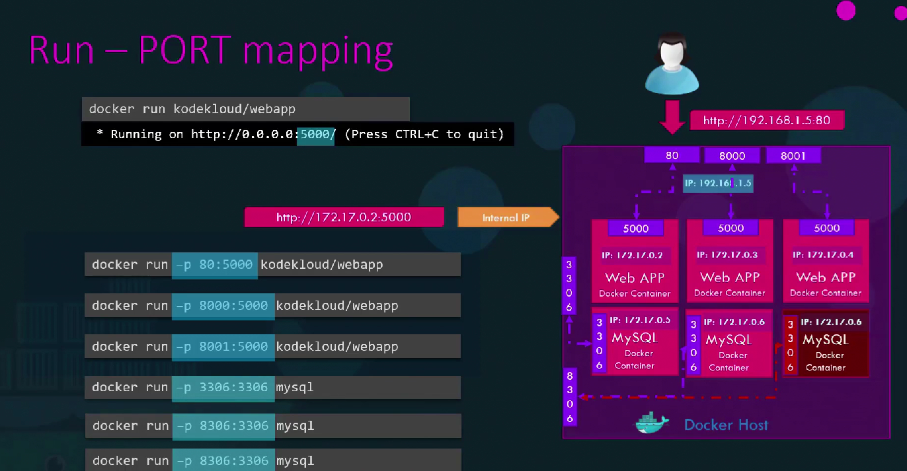

# Docker Training Session Guide

This repository is designed for a live Docker class.  
The image sequence is intentionally ordered, and the content below follows the same order from **1 to 24**.

---

## Session Goals

- Understand what containers are and why they matter.
- Explain Docker architecture and lifecycle clearly.
- Demonstrate Dockerfile, image layering, volume persistence, and Docker Compose.
- Run simple, practical examples that participants can reproduce on their own machine.

---

## Prerequisites for Participants

- Docker Desktop installed and running.
- Basic terminal usage.
- Internet access (for pulling base images).
- Recommended: at least 8 GB RAM.
- Commands in this guide are written to be PowerShell-friendly.

---

## Command Style by Host OS

Use the command style that matches your host machine:

- **Windows (PowerShell)**: use `cd .\path\to\dir` and `${PWD}` for current path.
- **Ubuntu/Linux/macOS (bash)**: use `cd ./path/to/dir` and `$(pwd)` for current path.

Most Docker commands are same across OS; only path formatting and line continuation differ.

Quick verification:

```bash
docker version
docker info
```

---

## Image-By-Image Theory (Serial Order)

### 1) `image/1.png` - What are Containers


Container = isolated packaged environment containing app + dependencies.

---

### 2) `image/2-onprem-virtualmachine.png` - Traditional VM Model


In VM world, each VM has a full guest OS. This adds overhead and slower startup.

---

### 3) `image/3-three-tier-app-on-vm.png` - 3-Tier App on VMs


Web, logic, and DB are split, often into separate VMs. Good isolation, but resource-heavy.

---

### 4) `image/4-container.png` - Containerized Model


Containers share host kernel through Docker Engine, so they are lightweight and fast to start.

---

### 5) `image/5-container-on-different-distribution.png` - Mixed Runtime Stacks


Different app stacks (Java, Python, MySQL) can run together consistently on one Docker host.

---

### 6) `image/6-delta-kernel-support-docker-engine.png` - Kernel Delta Concept


Containers rely on host kernel. Image layers carry user-space dependencies; kernel remains shared.

---

### 7) `image/7-application-architecture-evolution-docker-importance.png` - Monolith to Microservices


Containers are a strong fit for microservices because they package and deploy services independently.

---

### 8) `image/8-microsvc-architecture.png` - Service per Container


Each microservice can run in its own container for independent scaling and deployment.

---

### 9) `image/9-multiple-replica-of-one-svc.png` - Replicas and Scale


You can run multiple replicas of a service container to handle load.

---

### 10) `image/10-docker-container-all-parts.png` - Docker Components


- Client sends commands (`docker build`, `docker run`).
- Daemon does the work.
- Registry stores images.

---

### 11) `image/11-docker-container-life-cycle.png` - Lifecycle


Typical flow: pull/build image -> run container -> modify -> push image.

---

### 12) `image/12-docker-architecture-in-ec2-server.png` - Real Deployment Architecture


Client communicates with daemon on host/EC2, daemon pulls/pushes images to Docker Hub or private registry.

---

### 13) `image/13-packaging-application.png` - Packaging with Dockerfile


Dockerfile defines the image. Image is a template. Container is a running instance.

---

### 14) `image/14-basic-python-docker-file.png` - Basic Dockerfile Example


Key Dockerfile instructions:
- `FROM` base image
- `RUN` install dependencies
- `COPY` app files
- `WORKDIR` working directory
- `EXPOSE` port metadata
- `ENTRYPOINT` or `CMD` startup command

---

### 15) `image/15-docker-file-layered-architecture.png` - Layered Build and Cache


Every instruction creates a layer. Unchanged layers are cached, making rebuilds faster.

---

### 16) `image/16-layered-architecture.png` - Read-Only Image + RW Container Layer


Image layers are read-only. Container adds a thin writable layer at runtime.

---

### 17) `image/17-copy-onwrite.png` - Copy-on-Write


If a file from an image layer is modified, a copy is created in container writable layer.

---

### 18) `image/18-docker-volume.png` - Volumes


Volumes store data outside container writable layer, so data survives container recreation.

---

### 19) `image/19-type-of-docker-network.png` - Default Networks


- `bridge`: default isolated network
- `none`: no networking
- `host`: container shares host network stack (Linux behavior)

---

### 20) `image/20-docker-network-command.png` - Custom Network Commands


Create custom bridges for better service isolation and naming.

---

### 21) `image/21-docker-embeded-dns.png` - Embedded DNS


Containers on same user-defined bridge can resolve each other by service/container name.

---

### 22) `image/22-linux-namespace-docker-evolution.png` - Linux Namespace Foundation


Namespaces isolate PID, network, mount, IPC, etc. This is the core of container isolation.

---

### 23) `image/23-container-process-same-host-process.png` - PID Namespace View


Container sees its own process tree (PID namespace), while host sees all processes globally.

**Key concept:** Processes inside a container have their own PID namespace starting from 1, but on the host they appear with different PIDs. This isolation is fundamental to container security.

---

## Demo: PID Namespace Isolation (Image 23)

This demo demonstrates how Linux PID namespaces isolate processes between containers and the host system.

Demo files are in `class-demo/pid-namespace-demo/`.

### A) Build the Image

Windows PowerShell:

```powershell
cd .\class-demo\pid-namespace-demo
docker build -t pid-demo:latest .
```

Ubuntu/Linux/macOS (bash):

```bash
cd ./class-demo/pid-namespace-demo
docker build -t pid-demo:latest .
```

### B) Run the Container

Windows PowerShell:

```powershell
docker run -d --name pid-demo-container -p 8083:80 pid-demo:latest
```

Ubuntu/Linux/macOS (bash):

```bash
docker run -d --name pid-demo-container -p 8083:80 pid-demo:latest
```

**Verify container is running:**

```bash
docker ps | grep pid-demo-container
```

### C) Add Additional Processes and Check Inside Container

**First, add some sleep processes to demonstrate multiple processes:**

Windows PowerShell:

```powershell
docker exec -d pid-demo-container sh -c "sleep 3600 & sleep 3600 & sleep 3600 &"
```

Ubuntu/Linux/macOS (bash):

```bash
docker exec -d pid-demo-container sh -c "sleep 3600 & sleep 3600 & sleep 3600 &"
```

**Now view processes from container's perspective:**

Windows PowerShell:

```powershell
docker exec pid-demo-container ps aux
```

Ubuntu/Linux/macOS (bash):

```bash
docker exec pid-demo-container ps aux
```

**Expected output (container's view):**
```
PID   USER     TIME  COMMAND
  1   root     0:00  nginx: master process nginx -g daemon off;
  7   nginx    0:00  nginx: worker process
  8   root     0:00  sleep 3600
  9   root     0:00  sleep 3600
 10   root     0:00  sleep 3600
```

**Key observation:** Inside the container, processes start from PID 1. The nginx master process is PID 1, and other processes have sequential PIDs (7, 8, 9, 10). The container sees its own isolated PID namespace.

**Alternative: Use `top` inside container:**

```bash
docker exec pid-demo-container top -b -n 1
```

**Get specific process PID inside container:**

```bash
docker exec pid-demo-container pgrep nginx
docker exec pid-demo-container pgrep sleep
```

### D) Check Processes on Host (Ubuntu VM)

**View processes from host's perspective:**

On Ubuntu/Linux host:

```bash
ps aux | grep pid-demo-container
```

**Or use `docker top` command (works on both Windows and Linux):**

```bash
docker top pid-demo-container
```

**Expected output (host's view):**
```
UID                 PID                 PPID                CMD
root                12345               12340               nginx: master process nginx -g daemon off;
systemd+            12350               12345               nginx: worker process
root                12355               12340               sleep 3600
root                12360               12340               sleep 3600
root                12365               12340               sleep 3600
```

**Key observation:** On the host, the same processes have completely different PIDs (e.g., 12345, 12350, 12355, etc.). These are much higher than the container's PIDs.

### E) Compare PIDs: Container vs Host

**Step 1: Get PID inside container (nginx master):**

```bash
CONTAINER_PID=$(docker exec pid-demo-container pgrep -f "nginx: master")
echo "Container sees nginx master as PID: $CONTAINER_PID"
```

**Step 2: Get the actual host PID:**

On Ubuntu/Linux:

```bash
# Get the container's main process PID on host
HOST_PID=$(docker inspect --format '{{.State.Pid}}' pid-demo-container)
echo "Container's main process on host is PID: $HOST_PID"

# Find all child processes
ps --ppid $HOST_PID -o pid,cmd
```

**Step 3: Show the mapping visually:**

```bash
echo "=== Container View ==="
docker exec pid-demo-container ps aux | head -6

echo ""
echo "=== Host View ==="
docker top pid-demo-container
```

### F) Detailed Process Tree Comparison

**Inside Container (PID namespace isolated):**

```bash
docker exec pid-demo-container ps auxf
```

**On Host (real PID namespace):**

On Ubuntu/Linux:

```bash
# Get container's PID on host
CONTAINER_HOST_PID=$(docker inspect --format '{{.State.Pid}}' pid-demo-container)

# Show process tree from host perspective
pstree -p $CONTAINER_HOST_PID
```

**Alternative using `docker inspect`:**

```bash
docker inspect pid-demo-container | grep -i pid
```

### G) Demonstrate PID Isolation

**Create a second container and compare:**

```bash
docker run -d --name pid-demo-container-2 -p 8084:80 pid-demo:latest
```

**Check processes in second container:**

```bash
docker exec pid-demo-container-2 ps aux
```

**Observation:** The second container also has processes starting from PID 1, completely independent from the first container.

**Compare both containers' processes:**

```bash
echo "=== Container 1 ==="
docker exec pid-demo-container ps aux | head -3

echo ""
echo "=== Container 2 ==="
docker exec pid-demo-container-2 ps aux | head -3

echo ""
echo "=== Host View (both containers) ==="
docker top pid-demo-container
docker top pid-demo-container-2
```

### H) Key Concepts Demonstrated

1. **PID Namespace Isolation:**
   - Each container has its own PID namespace
   - Processes inside container start from PID 1
   - Host sees different PIDs for the same processes

2. **Process Mapping:**
   - Container PID 1 → Host PID (e.g., 12345)
   - Container PID 8 → Host PID (e.g., 12355)
   - Mapping is transparent to processes inside container

3. **Security Implication:**
   - Container processes cannot see host processes
   - Container processes cannot directly interact with host processes by PID
   - Isolation prevents container from affecting host system processes

### I) Cleanup

```bash
docker rm -f pid-demo-container pid-demo-container-2
docker rmi pid-demo:latest
```

### J) Quick Reference Commands

```bash
# View processes inside container
docker exec <container> ps aux

# View processes from host perspective
docker top <container>

# Get container's main process PID on host
docker inspect --format '{{.State.Pid}}' <container>

# Find specific process PID inside container
docker exec <container> pgrep <process_name>

# Show process tree inside container
docker exec <container> ps auxf

# Show process tree on host (Linux)
pstree -p $(docker inspect --format '{{.State.Pid}}' <container>)
```

---

### 24) `image/24-docker-compose-evolution.png` - Docker Compose Evolution


Compose manages multi-container apps using one YAML file, with cleaner dependency and network management.

---

### 25) `image/25-server-docker-portmapping.png` - Port Mapping


Port mapping (`-p host_port:container_port`) exposes container services to the host and external networks. Without mapping, services are only accessible via container internal IPs. Multiple containers can map different host ports to the same container port, enabling multiple instances of the same service.

**Key concepts:**
- `docker run -p 80:5000` maps host port 80 to container port 5000
- `docker run -p 8000:5000` maps host port 8000 to container port 5000
- Without `-p`, the service is only reachable via container's internal IP (e.g., `172.17.0.2:5000`)
- With `-p`, external users access via host IP and mapped port (e.g., `http://192.168.1.5:80`)

---

## Ubuntu Setup (Docker + Docker Compose)

Run these steps on Ubuntu before starting live demos.

### 1) Remove old/conflicting packages (safe if not installed)

```bash
for pkg in docker.io docker-doc docker-compose docker-compose-v2 podman-docker containerd runc; do
  sudo apt-get remove -y $pkg
done
```

### 2) Install Docker official repository

```bash
sudo apt-get update
sudo apt-get install -y ca-certificates curl gnupg
sudo install -m 0755 -d /etc/apt/keyrings
curl -fsSL https://download.docker.com/linux/ubuntu/gpg | sudo gpg --dearmor -o /etc/apt/keyrings/docker.gpg
sudo chmod a+r /etc/apt/keyrings/docker.gpg

echo \
  "deb [arch=$(dpkg --print-architecture) signed-by=/etc/apt/keyrings/docker.gpg] https://download.docker.com/linux/ubuntu \
  $(. /etc/os-release && echo $VERSION_CODENAME) stable" | \
  sudo tee /etc/apt/sources.list.d/docker.list > /dev/null
```

### 3) Install Docker Engine + Compose plugin

```bash
sudo apt-get update
sudo apt-get install -y docker-ce docker-ce-cli containerd.io docker-buildx-plugin docker-compose-plugin
```

### 4) Start and enable Docker service

```bash
sudo systemctl enable docker
sudo systemctl start docker
```

### 5) (Recommended) Run Docker without sudo

```bash
sudo groupadd docker 2>/dev/null || true
sudo usermod -aG docker $USER
newgrp docker
```

If group changes do not apply immediately, log out and log back in once.

### 6) Verify installation

```bash
docker version
docker compose version
docker run --rm hello-world
```

---

## Live Demo Plan (Step-by-Step)

Use this sequence during class:

1. Docker fundamentals check
2. Dockerfile demo (build and run Python app)
3. Volume demo (data persistence)
4. DNS Name Resolution demo (embedded DNS, container name resolution)
5. Compose demo (web + db services)
6. Docker Hub demo (login, tag, push, verify)
7. **Optional Advanced:** PID Namespace demo (process isolation - Image 23)

---

## Demo 1: Dockerfile Basic Example

Demo files are in `class-demo/dockerfile-demo/`.

### A) Build Image

Windows PowerShell:

```powershell
cd .\class-demo\dockerfile-demo
docker build -t class/python-demo:v1 .
```

Ubuntu/Linux/macOS (bash):

```bash
cd ./class-demo/dockerfile-demo
docker build -t class/python-demo:v1 .
```

### B) Run Container

Windows PowerShell:

```powershell
docker run --rm -p 8000:8000 --name python-demo class/python-demo:v1
```

Ubuntu/Linux/macOS (bash):

```bash
docker run --rm -p 8000:8000 --name python-demo class/python-demo:v1
```

Open: `http://localhost:8000`

### C) Observe Layer Cache

Rebuild once:

Windows PowerShell:

```powershell
docker build -t class/python-demo:v2 .
```

Ubuntu/Linux/macOS (bash):

```bash
docker build -t class/python-demo:v2 .
```

Change only app code (`app.py`) and rebuild. Show that dependency layers are reused.

---

## Demo 2: Docker Volume Example

### A) Create Named Volume

Windows PowerShell:

```powershell
docker volume create class_mysql_data
docker volume ls
```

Ubuntu/Linux/macOS (bash):

```bash
docker volume create class_mysql_data
docker volume ls
```

### B) Run MySQL Using Volume

Windows PowerShell:

```powershell
docker run -d --name class-mysql -e MYSQL_ROOT_PASSWORD=root123 -e MYSQL_DATABASE=training -v class_mysql_data:/var/lib/mysql -p 3307:3306 mysql:8
```

Ubuntu/Linux/macOS (bash):

```bash
docker run -d --name class-mysql -e MYSQL_ROOT_PASSWORD=root123 -e MYSQL_DATABASE=training -v class_mysql_data:/var/lib/mysql -p 3307:3306 mysql:8
```

### C) Prove Persistence

1) Create table and insert sample data:

Windows PowerShell:

```powershell
docker exec -it class-mysql mysql -uroot -proot123 -e "USE training; CREATE TABLE IF NOT EXISTS students (id INT AUTO_INCREMENT PRIMARY KEY, name VARCHAR(100) NOT NULL); INSERT INTO students (name) VALUES ('Alice'),('Bob'),('Charlie'); SELECT * FROM students;"
```

Ubuntu/Linux/macOS (bash):

```bash
docker exec -it class-mysql mysql -uroot -proot123 -e "USE training; CREATE TABLE IF NOT EXISTS students (id INT AUTO_INCREMENT PRIMARY KEY, name VARCHAR(100) NOT NULL); INSERT INTO students (name) VALUES ('Alice'),('Bob'),('Charlie'); SELECT * FROM students;"
```

2) Stop and remove container:

Windows PowerShell:

```powershell
docker rm -f class-mysql
```

Ubuntu/Linux/macOS (bash):

```bash
docker rm -f class-mysql
```

3) Run same command again (same volume).  
4) Verify data still exists after container recreation:

Windows PowerShell:

```powershell
docker exec -it class-mysql mysql -uroot -proot123 -e "USE training; SELECT * FROM students;"
```

Ubuntu/Linux/macOS (bash):

```bash
docker exec -it class-mysql mysql -uroot -proot123 -e "USE training; SELECT * FROM students;"
```

### D) Bind Mount Quick Example (Optional)

Windows PowerShell:

```powershell
docker run --rm -it -v "${PWD}/class-demo/volume-demo:/data" alpine sh
```

Ubuntu/Linux/macOS (bash):

```bash
docker run --rm -it -v "$(pwd)/class-demo/volume-demo:/data" alpine sh
```

Create file inside `/data` and show it appears on host folder.

---

## Demo 3: Docker DNS Name Resolution Lab

This demo demonstrates Docker's embedded DNS server and how containers on the same user-defined network can resolve each other by container name.

**Goal:**
- Create a Docker network
- Run two containers on the same network
- Ping container by name
- Inspect Docker DNS server (127.0.0.11)
- Show how the name resolves internally

### Step 1: Create a Custom Docker Network

Windows PowerShell:

```powershell
docker network create lab-net
```

Ubuntu/Linux/macOS (bash):

```bash
docker network create lab-net
```

**Verify:**

```bash
docker network ls
```

You should see `lab-net` in the list.

### Step 2: Start Container 1

We use Alpine because it has small networking tools.

Windows PowerShell:

```powershell
docker run -dit --name nginx1 --network lab-net alpine sh
```

Ubuntu/Linux/macOS (bash):

```bash
docker run -dit --name nginx1 --network lab-net alpine sh
```

**Explanation:**
- `-d` → run in background
- `-i` → interactive
- `-t` → terminal

### Step 3: Start Container 2

Windows PowerShell:

```powershell
docker run -dit --name nginx2 --network lab-net alpine sh
```

Ubuntu/Linux/macOS (bash):

```bash
docker run -dit --name nginx2 --network lab-net alpine sh
```

Now both containers are inside the same network.

### Step 4: Check Their IP Addresses

**Get nginx1 IP:**

```bash
docker inspect -f '{{range .NetworkSettings.Networks}}{{.IPAddress}}{{end}}' nginx1
```

**Example output:** `172.18.0.2`

**Get nginx2 IP:**

```bash
docker inspect -f '{{range .NetworkSettings.Networks}}{{.IPAddress}}{{end}}' nginx2
```

**Example output:** `172.18.0.3`

### Step 5: Enter Container 1

Windows PowerShell:

```powershell
docker exec -it nginx1 sh
```

Ubuntu/Linux/macOS (bash):

```bash
docker exec -it nginx1 sh
```

Now you are inside container `nginx1`.

### Step 6: Install Ping + DNS Tools

Inside the container, run:

```bash
apk add iputils bind-tools
```

This installs:
- `ping`
- `nslookup`
- `dig`

### Step 7: Ping Container by Name

Inside container, run:

```bash
ping nginx2
```

**Example result:**
```
PING nginx2 (172.18.0.3): 56 data bytes
64 bytes from 172.18.0.3: seq=0 ttl=64 time=0.08 ms
64 bytes from 172.18.0.3: seq=1 ttl=64 time=0.10 ms
...
```

**Press `Ctrl+C` to stop ping.**

**Important point:**
- `ping nginx2` - Docker resolves `nginx2 → 172.18.0.3`
- Container name resolution works automatically!

### Step 8: Verify DNS Resolution Explicitly

**Using nslookup:**

```bash
nslookup nginx2
```

**Example output:**
```
Server:    127.0.0.11
Address 1: 127.0.0.11

Name:      nginx2
Address 1: 172.18.0.3
```

**Key observation:**
- DNS server = `127.0.0.11`
- This is Docker's internal DNS server

**Using dig:**

```bash
dig nginx2
```

**Example output:**
```
;; QUESTION SECTION:
;nginx2.				IN	A

;; ANSWER SECTION:
nginx2.			600	IN	A	172.18.0.3
```

### Step 9: Check /etc/resolv.conf

Inside container, run:

```bash
cat /etc/resolv.conf
```

**Output will look like:**
```
nameserver 127.0.0.11
options ndots:0
```

**Meaning:**
- Container → query DNS → `127.0.0.11`
- Docker intercepts this request

### Step 10: Check Container Hostname Resolution

Run:

```bash
getent hosts nginx2
```

**Example:**
```
172.18.0.3 nginx2
```

Again proving DNS resolution works.

### Step 11: Inspect Hosts File

Run:

```bash
cat /etc/hosts
```

**You will see something like:**
```
127.0.0.1 localhost
172.18.0.2 nginx1
```

**Important:**
- `nginx2` will **NOT** appear here
- Because Docker uses DNS server, not hosts file, for other containers

### Step 12: Exit Container

```bash
exit
```

### How Docker DNS Actually Works Internally

**When container starts:**
Docker registers:
- Container name
- Container ID
- Network
- IP address

Inside an embedded DNS database.

**Example mapping stored internally:**
```
nginx1 → 172.18.0.2
nginx2 → 172.18.0.3
```

### DNS Resolution Flow

```
Container nginx1
      |
      | ping nginx2
      |
glibc resolver
      |
/etc/resolv.conf
      |
nameserver 127.0.0.11
      |
Docker embedded DNS
      |
Lookup container registry
      |
Return IP 172.18.0.3
      |
Ping sent
```

### Visual Architecture

```
Container nginx1
      |
      | DNS Query nginx2
      |
127.0.0.11 (Docker DNS)
      |
Docker Network DB
      |
nginx2 → 172.18.0.3
      |
Response returned
```

### Important Rule

**Docker DNS works only when containers are on same user-defined network.**

✅ **Works here:**
```bash
docker network create lab-net
docker run --network lab-net ...
```

❌ **Does NOT work on default bridge** with automatic name resolution.

### Step 13: Cleanup

Exit from container if still inside, then:

```bash
docker rm -f nginx1 nginx2
docker network rm lab-net
```

### Quick Command Summary

```bash
# Create network
docker network create lab-net

# Start containers
docker run -dit --name nginx1 --network lab-net alpine sh
docker run -dit --name nginx2 --network lab-net alpine sh

# Enter container
docker exec -it nginx1 sh

# Install tools (inside container)
apk add iputils bind-tools

# Test DNS resolution (inside container)
ping nginx2
nslookup nginx2
dig nginx2
getent hosts nginx2

# Check configuration (inside container)
cat /etc/resolv.conf
cat /etc/hosts

# Cleanup
docker rm -f nginx1 nginx2
docker network rm lab-net
```

---

## Demo 4: Docker Compose Basic Example

Demo files are in `class-demo/compose-demo/`.

### A) Start Services

Windows PowerShell:

```powershell
cd .\class-demo\compose-demo
docker compose up --build -d
```

Ubuntu/Linux/macOS (bash):

```bash
cd ./class-demo/compose-demo
docker compose up --build -d
```

### B) Verify

Windows PowerShell:

```powershell
docker compose ps
docker compose logs -f web
```

Ubuntu/Linux/macOS (bash):

```bash
docker compose ps
docker compose logs -f web
```

**Check web service:**

Open: `http://localhost:8080`

You should see:
```json
{"message": "Docker Compose demo: web + mysql"}
```

**Check database connection endpoint:**

Open: `http://localhost:8080/db-check`

**Or if accessing from another machine (e.g., Ubuntu VM), use the host IP:**

Open: `http://192.168.56.104:8080/db-check`

**Expected response:**
```json
{"students": 3}
```

This confirms:
- Flask app is running
- Database connection works
- Data is accessible via the web service

### C) Check Database Directly (MySQL Container)

You can also verify the database directly by entering the MySQL container.

#### 1) Enter the MySQL Container

Windows PowerShell:

```powershell
docker exec -it class-demo-db mysql -uroot -proot123 training
```

Ubuntu/Linux/macOS (bash):

```bash
docker exec -it class-demo-db mysql -uroot -proot123 training
```

**Meaning:**
- `docker exec -it` → enter running container process interactively
- `class-demo-db` → your DB container name
- `mysql` → start MySQL client inside the container
- `-uroot` → MySQL username
- `-proot123` → password
- `training` → database name

After entering, you should see a MySQL prompt like:
```
mysql>
```

#### 2) Show All Tables

Inside MySQL, run:

```sql
SHOW TABLES;
```

**Expected output:**
```
+--------------------+
| Tables_in_training |
+--------------------+
| students           |
+--------------------+
```

#### 3) Check All Rows in Students Table

Run:

```sql
SELECT * FROM students;
```

**Expected output:**
```
+----+---------+
| id | name    |
+----+---------+
|  1 | Alice   |
|  2 | Bob     |
|  3 | Charlie |
+----+---------+
```

#### 4) Check the Count (Same as Flask Endpoint)

Run:

```sql
SELECT COUNT(*) AS total FROM students;
```

**Expected output:**
```
+-------+
| total |
+-------+
|     3 |
+-------+
```

This is the same result your Flask endpoint returned: `{"students": 3}`

#### 5) Exit MySQL Shell

Run:

```sql
exit
```

or

```sql
quit
```

### D) One-Line Direct Check (Without Entering Interactive Shell)

If you want to run a query directly from host terminal without entering the MySQL shell:

**Show all student rows:**

Windows PowerShell:

```powershell
docker exec -it class-demo-db mysql -uroot -proot123 training -e "SELECT * FROM students;"
```

Ubuntu/Linux/macOS (bash):

```bash
docker exec -it class-demo-db mysql -uroot -proot123 training -e "SELECT * FROM students;"
```

**Get count:**

```bash
docker exec -it class-demo-db mysql -uroot -proot123 training -e "SELECT COUNT(*) AS total FROM students;"
```

### E) Very Useful Quick Commands

**Show databases:**

```bash
docker exec -it class-demo-db mysql -uroot -proot123 -e "SHOW DATABASES;"
```

**Show tables in training database:**

```bash
docker exec -it class-demo-db mysql -uroot -proot123 training -e "SHOW TABLES;"
```

**Describe table structure:**

```bash
docker exec -it class-demo-db mysql -uroot -proot123 training -e "DESCRIBE students;"
```

**Show all student rows:**

```bash
docker exec -it class-demo-db mysql -uroot -proot123 training -e "SELECT * FROM students;"
```

### F) Important Understanding

**Request Flow:**

Your browser request `/db-check` goes like this:

```
Browser → Flask container → MySQL container → students table
```

**When you query directly inside DB container:**
- You are bypassing Flask
- You are checking the source data itself
- This is useful for debugging and verification

### G) Explain Compose Concepts

- Service definitions (`web`, `db`)
- Automatic network
- Volume mounting for DB persistence
- Environment variables
- Dependency with `depends_on`
- Service communication via container names

### H) Stop and Cleanup

Windows PowerShell:

```powershell
docker compose down
```

Ubuntu/Linux/macOS (bash):

```bash
docker compose down
```

To remove volume as well:

Windows PowerShell:

```powershell
docker compose down -v
```

Ubuntu/Linux/macOS (bash):

```bash
docker compose down -v
```

---

## Demo 5: Docker Hub Push (Image Registry)

This demo shows how to push a Docker image to Docker Hub, making it available publicly or privately.

Demo files are in `class-demo/dockerhub-demo/`.

### Prerequisites

1. **Create Docker Hub Account** (if not already done):
   - Go to [https://hub.docker.com](https://hub.docker.com)
   - Click "Sign Up" and create a free account
   - Verify your email address
   - Note your Docker Hub username (e.g., `yourusername`)

### A) Build the Image

Windows PowerShell:

```powershell
cd .\class-demo\dockerhub-demo
docker build -t nginx-demo:v1 .
```

Ubuntu/Linux/macOS (bash):

```bash
cd ./class-demo/dockerhub-demo
docker build -t nginx-demo:v1 .
```

**Verify the image was created:**

```bash
docker images nginx-demo:v1
```

### B) Test the Image Locally

Windows PowerShell:

```powershell
docker run -d -p 8081:80 --name nginx-test nginx-demo:v1
```

Ubuntu/Linux/macOS (bash):

```bash
docker run -d -p 8081:80 --name nginx-test nginx-demo:v1
```

Open: `http://localhost:8081` to verify it works.

**Stop and remove test container:**

```bash
docker rm -f nginx-test
```

### C) Login to Docker Hub

Windows PowerShell:

```powershell
docker login
```

Ubuntu/Linux/macOS (bash):

```bash
docker login
```

**What to expect:**
- Enter your Docker Hub username
- Enter your Docker Hub password (or access token)
- Success message: `Login Succeeded`

**Note:** If you have 2FA enabled, use an access token instead of password. Create one at: Docker Hub → Account Settings → Security → New Access Token

### D) Tag the Image for Docker Hub

**Important:** Docker Hub requires images to be tagged with format: `username/imagename:tag`

Replace `yourusername` with your actual Docker Hub username:

Windows PowerShell:

```powershell
docker tag nginx-demo:v1 yourusername/nginx-demo:v1
docker tag nginx-demo:v1 yourusername/nginx-demo:latest
```

Ubuntu/Linux/macOS (bash):

```bash
docker tag nginx-demo:v1 yourusername/nginx-demo:v1
docker tag nginx-demo:v1 yourusername/nginx-demo:latest
```

**Verify tags:**

```bash
docker images | grep nginx-demo
```

You should see:
- `nginx-demo:v1`
- `yourusername/nginx-demo:v1`
- `yourusername/nginx-demo:latest`

### E) Push Image to Docker Hub

Windows PowerShell:

```powershell
docker push yourusername/nginx-demo:v1
docker push yourusername/nginx-demo:latest
```

Ubuntu/Linux/macOS (bash):

```bash
docker push yourusername/nginx-demo:v1
docker push yourusername/nginx-demo:latest
```

**What to expect:**
- Layers will be pushed one by one
- Progress bars show upload status
- Success message: `v1: digest: sha256:...`

**Note:** First push may take a few minutes depending on internet speed.

### F) Verify on Docker Hub Website

1. Go to [https://hub.docker.com](https://hub.docker.com)
2. Login to your account
3. Click on your profile → "Repositories"
4. You should see `yourusername/nginx-demo` listed
5. Click on the repository to see:
   - Tags: `v1` and `latest`
   - Image size
   - Pull command: `docker pull yourusername/nginx-demo:latest`
   - Last pushed timestamp

### G) Test Pulling from Docker Hub

**Remove local image first:**

```bash
docker rmi yourusername/nginx-demo:v1 yourusername/nginx-demo:latest nginx-demo:v1
```

**Pull from Docker Hub:**

Windows PowerShell:

```powershell
docker pull yourusername/nginx-demo:latest
docker run -d -p 8082:80 --name nginx-from-hub yourusername/nginx-demo:latest
```

Ubuntu/Linux/macOS (bash):

```bash
docker pull yourusername/nginx-demo:latest
docker run -d -p 8082:80 --name nginx-from-hub yourusername/nginx-demo:latest
```

Open: `http://localhost:8082` - should show the same page!

**Cleanup:**

```bash
docker rm -f nginx-from-hub
```

### H) Key Concepts Explained

- **Docker Hub**: Public registry for Docker images (like GitHub for code)
- **Tagging**: `docker tag` creates a new reference to the same image layer
- **Pushing**: `docker push` uploads image layers to registry
- **Pulling**: `docker pull` downloads image from registry
- **Image naming**: `username/repository:tag` format required for Docker Hub
- **Latest tag**: Convention for most recent stable version

### I) Common Commands Reference

```bash
# Login
docker login

# Logout
docker logout

# List your images
docker images

# Tag image
docker tag <source> <target>

# Push image
docker push <username>/<image>:<tag>

# Pull image
docker pull <username>/<image>:<tag>

# Search public images
docker search nginx
```

---

## Useful Commands for Class Q&A

```bash
docker ps -a
docker images
docker logs <container>
docker exec -it <container> sh
docker inspect <container_or_image>
docker network ls
docker volume ls
docker system df
```

---

## Suggested 90-Minute Session Timeline

- 0-20 min: Concepts using image 1-12
- 20-40 min: Dockerfile + image layers (13-17)
- 40-55 min: Volume and persistence (18)
- 55-70 min: Networks + DNS (19-21)
- 70-80 min: Compose demo (24)
- 80-90 min: Docker Hub push demo + Q&A

**Extended 120-Minute Option:**
- 0-20 min: Concepts using image 1-12
- 20-40 min: Dockerfile + image layers (13-17)
- 40-55 min: Volume and persistence (18)
- 55-70 min: Networks + DNS (19-21)
- 70-85 min: Compose demo (24)
- 85-105 min: Docker Hub push demo (login, tag, push, verify)
- 105-120 min: Q&A and recap

---

## Practice Tasks for Participants

1. Build Dockerfile demo image and run it on port `8001`.
2. Add one new endpoint in `app.py` and rebuild.
3. Create a named volume and mount it to any container.
4. Run compose demo and access web service.
5. Stop compose and restart without losing DB data.
6. Build nginx-demo image, tag it with your Docker Hub username, and push to Docker Hub.

---

## Important Teaching Notes

- Explain the difference clearly: **image != container**.
- Emphasize persistence problem without volumes.
- Show real commands live; avoid only slides.
- Keep one terminal for commands and one for logs.
- Ask participants to run each step with you.


