# Container Networking Experiments

This document is converted from `container-networking-all.docx` and keeps the six container networking experiments with their original diagrams/screenshots for GitHub viewing.

## Table of Contents

- [Experiment 1: Network Namespace Inspecting](#experiment-1-network-namespace-inspecting)
- [Experiment 2: Connect Network Namespace to Host](#experiment-2-connect-network-namespace-to-host)
- [Experiment 3: Connect Network Namespace to Root Namespace](#experiment-3-connect-network-namespace-to-root-namespace)
- [Experiment 4: Egress Traffic](#experiment-4-egress-traffic)
- [Experiment 5: Connect Two Custom Network Namespaces](#experiment-5-connect-two-custom-network-namespaces)
- [Experiment 6: Bridge Networking Among Namespaces](#experiment-6-bridge-networking-among-namespaces)

## Experiment 1: Network Namespace Inspecting

### Linux Network Stack

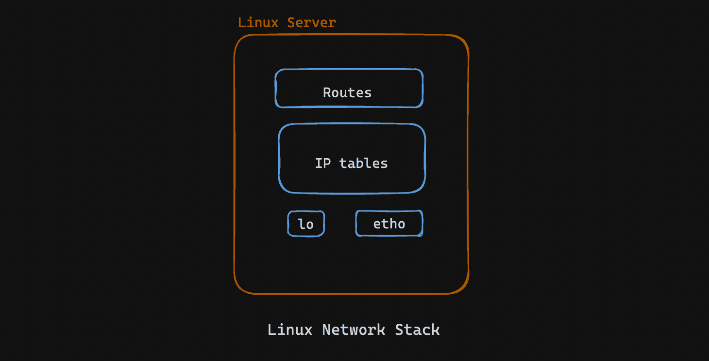

In Linux networking, within the Linux network stack, routes define
traffic paths, iptables configures packet filtering, lo is a local
loopback interface for testing, and eth0 is the primary Ethernet
interface for external connections. Let's inspect the network stack, in
short.

Network interfaces allow us to establish communication between a network
and a device.

ip link list

lo is the loopback interface, allowing local network communication
within a device without external network involvement. Verify the
loopback interface is up

ifconfig lo

A route in networking specifies the path for network traffic from source
to destination. View the routing table:

ip route show

iptables is a user-space utility for configuring packet filter rules in
the Linux kernel's Netfilter framework. View iptables rules:

iptables -L

### Create Custom Network Namespace

Let's create a custom namespace using ip netns add utiliy.

> sudo ip netns add ntech

sudo ip netns list

Now, entering a network namespace in Linux:

ip netns exec

It is part of the iproute2 package and is often used for managing
network namespaces.

sudo ip netns exec ntech bash

nsenter

The nsenter utility is commonly used to enter into namespaces in Linux,
including network namespaces.

sudo nsenter --net=/var/run/netns/ntech bash

Now, check the network interfaces inside the new ns.

ip link show

Let's check for iptable rules for custom ns.

ifconfig lo

## Experiment 2: Connect Network Namespace to Host

### Connecting a container to host using virtual Ethernet cable

In root ns, it looks like

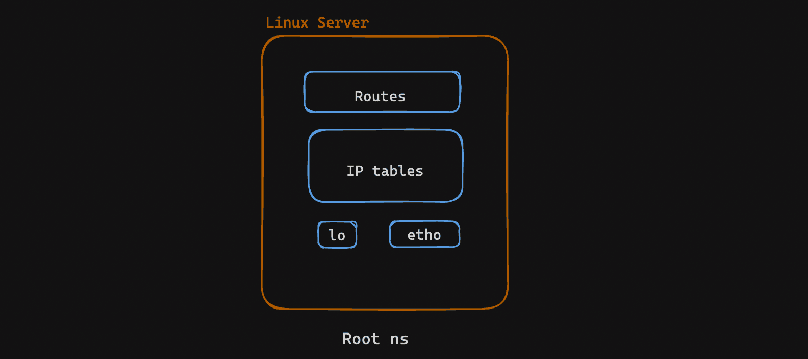

Let's create a custom namespace using ip netns add utiliy.

> sudo ip netns add red

sudo ip netns list

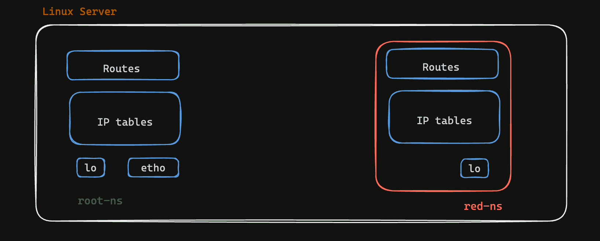

From the root network namespace, let's create a veth cable:

sudo ip link add veth-red type veth peer name veth-host

We just created a pair of interconnected virtual Ethernet devices or
interfaces, whatever we say. Both veth-red and veth-host lies inside the
root ns.

ip link list

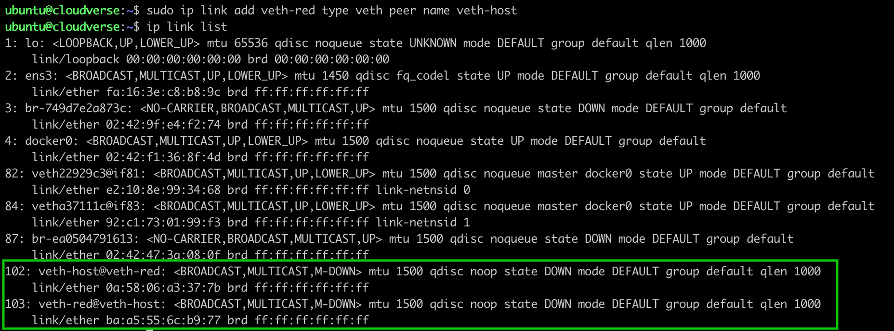

To connect the root namespace with the red namespace, we need to keep
one end of the cable in the root namespace and move another one end into
the red ns.

sudo ip link set veth-red netns red

This moves one end of the veth pair (veth-red) into the "red" namespace.
The other end (veth-host) remains in the default network namespace.

Now, let's configure IP Addresses to both end of this veth cable and
once we turn up the interfaces, the peer device will instantly display
any packet that appears on one of the devices.

In the "red" namespace:

> sudo ip netns exec red ip addr add 192.168.1.1/24 dev veth-red

sudo ip netns exec red ip link set veth-red up

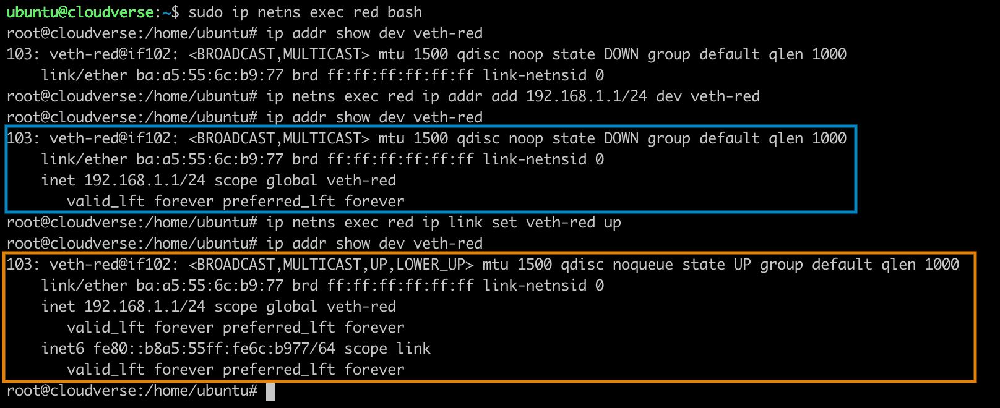

On the host side:

> sudo ip addr add 192.168.1.2/24 dev veth-host

sudo ip link set veth-host up

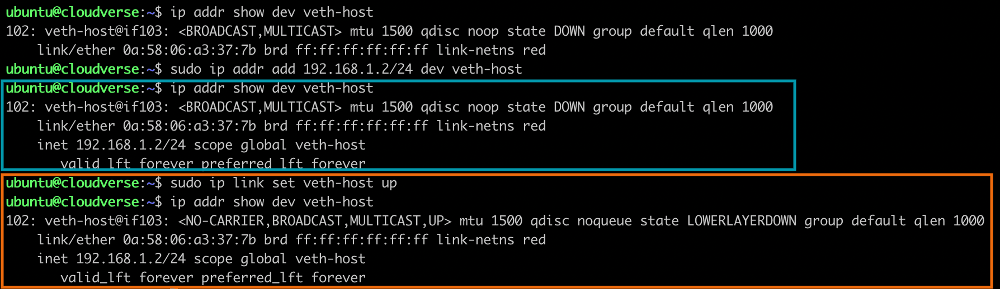

The virtual ethernet pair is now ready.

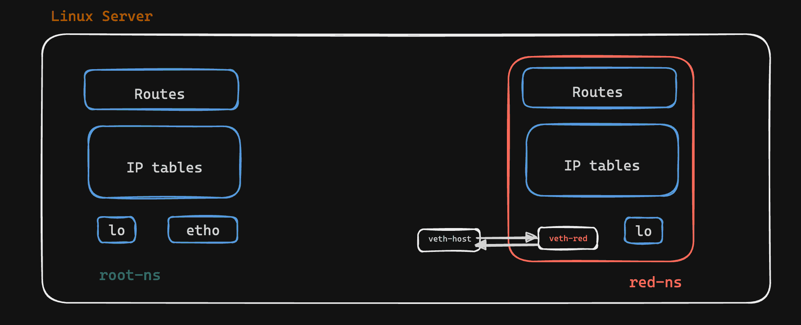

A route is needed to add on the host to direct traffic destined for
192.168.1.1 through the veth-host interface.

sudo ip route add 192.168.1.1 dev veth-host

## Why Add a Route?

Without adding the route, the system doesn't know how to reach
192.168.1.1. When we ping 192.168.1.1, the system checks its routing
table to determine where to send the ping packets. If there's no
specific route for 192.168.1.1, it won't know which interface to use.

By adding the route, we are explicitly telling the system that to reach
192.168.1.1, it should send the traffic through the veth-host interface,
which is part of the veth pair connected to the "red" namespace.

### Test Connectivity

Let's try to ping the red ns from the veth-host interface:

ping 192.168.1.1 -c 3

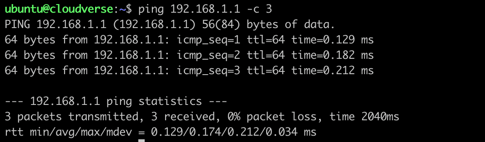

Again, let's try to ping the veth-host interface from the red namespace:

> sudo ip netns exec red bash

ping 192.168.1.2 -c 3

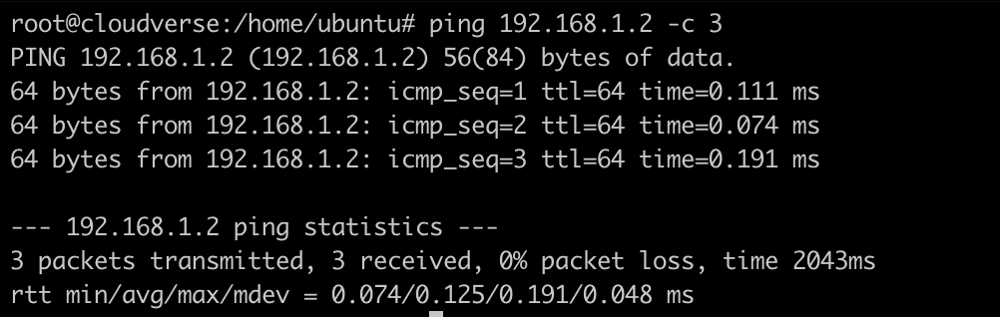

## Experiment 3: Connect Network Namespace to Root Namespace

### Connecting a container network namespace to root network namespace

Let's create a custom network namespace ns0 and a bridge br0. In Linux
networking, a bridge is a virtual network device that connects multiple
network interfaces, allowing them to function as a single logical
network.

sudo ip netns add ns0

sudo ip link add br0 type bridge

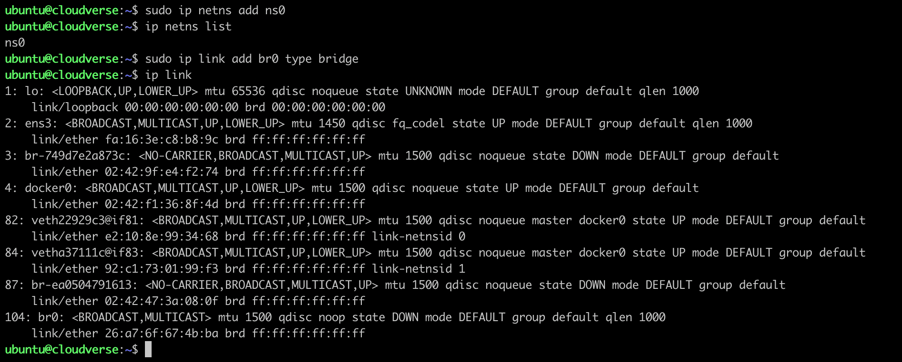

### Configure a bridge interface

A new device, the br0 bridge interface, has been created, but it's now
in a DOWN state. Let's assign ip address and turn it into UP state.

sudo ip link set br0 up

sudo ip addr add 192.168.0.1/16 dev br0

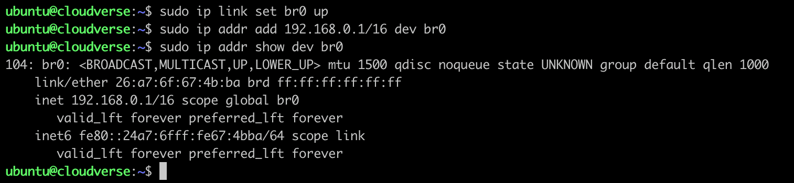

Now let's verify whether br0 is able to receive the packet or not.

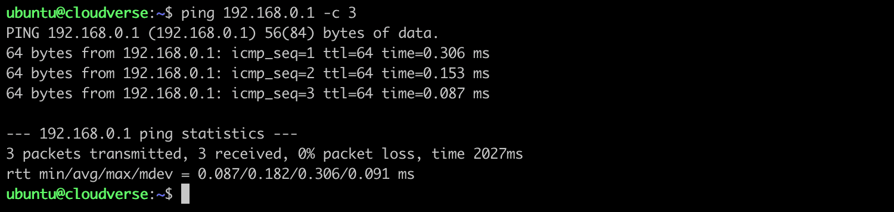

### Configure virtual ethernet cable

It's time to set up a virtual Ethernet cable. One cable hand will be
configured as a nic card in the ns0 namespace, while the other hand will
be configured in the br0 interface.

sudo ip link add veth0 type veth peer name ceth0

sudo ip link set ceth0 netns ns0

sudo ip link set veth0 master br0

Both end of this cable is now in DOWN state. Let's turn into UP state

sudo ip netns exec ns0 ip link set ceth0 up

sudo ip link set veth0 up

### Configure ns0 namespace

We need to assign an ip address to ceth0 and turn loopback interface
into UP state.

sudo ip link set lo up

sudo ip addr add 192.168.0.2/16 dev ceth0

### Namespace ns0 to root ns Communication

Let's check the Ip address assigned to primary ethernet interface of
host machine.

ip addr show

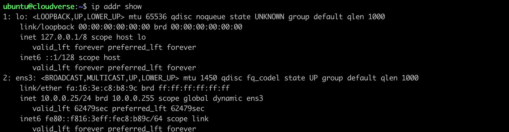

Now, ping to this ip address

sudo ip netns exec ns0 bash

ping 10.0.0.25

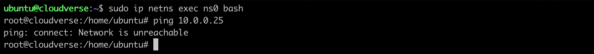

It says network in unreachable. So, something is not okay. Let's check
the route table.

route

The output may look like.

Kernel IP routing table

Destination Gateway Genmask Flags Metric Ref Use Iface

192.168.0.0 0.0.0.0 255.255.0.0 U 0 0 0 ceth0

This routing table entry indicates that any destination IP address
within the 192.168.0.0/16 network should be reached directly through the
ceth0 interface, without the need for a specific gateway.

So we need to add a Default Gateway in the route table.

ip netns exec ns0 bash

ip route add default via 192.168.0.1

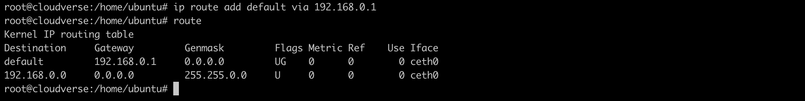

Now we are good to go! Let's ping again.

sudo ip netns exec ns0 bash

ping 10.0.0.25 -c 5

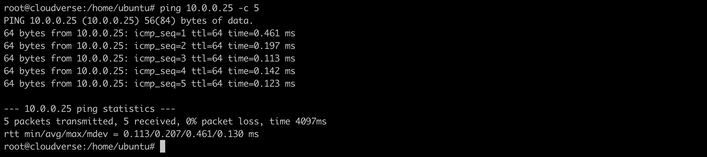

## Experiment 4: Egress Traffic

### Connecting a container network namespace to root network namespace

Let's create a custom network namespace ns0 and a bridge br0. In Linux
networking, a bridge is a virtual network device that connects multiple
network interfaces, allowing them to function as a single logical
network.

> sudo ip netns add ns0

sudo ip link add br0 type bridge

### Configure a bridge interface

A new device, the br0 bridge interface, has been created, but it's now
in a DOWN state. Let's assign ip address and turn it into UP state.

> sudo ip link set br0 up

sudo ip addr add 192.168.0.1/16 dev br0

Now let's verify whether br0 is able to receive the packet or not.

### Configure virtual ethernet cable

It's time to set up a virtual Ethernet cable. One cable hand will be
configured as a nic card in the ns0 namespace, while the other hand will
be configured in the br0 interface.

> sudo ip link add veth0 type veth peer name ceth0
>
> sudo ip link set ceth0 netns ns0

sudo ip link set veth0 master br0

Both end of this cable is now in DOWN state. Let's turn into UP state

> sudo ip netns exec ns0 ip link set ceth0 up

sudo ip link set veth0 up

### Configure ns0 namespace

We need to assign an ip address to ceth0 and turn loopback interface
into UP state.

> sudo ip link set lo up

sudo ip addr add 192.168.0.2/16 dev ceth0

### Namespace ns0 to root ns Communication

Let's check the Ip address assigned to primary ethernet interface of
host machine.

ip addr show

Now, ping to this ip address

> sudo ip netns exec ns0 bash

ping 10.0.0.25

It says network in unreachable. So, something is not okay. Let's check
the route table.

route

The output may look like.

> Kernel IP routing table
>
> Destination Gateway Genmask Flags Metric Ref Use Iface

192.168.0.0 0.0.0.0 255.255.0.0 U 0 0 0 ceth0

This routing table entry indicates that any destination IP address
within the 192.168.0.0/16 network should be reached directly through the
ceth0 interface, without the need for a specific gateway.

So we need to add a Default Gateway in the route table.

> ip netns exec ns0 bash

ip route add default via 192.168.0.1

Now we are good to go! Let's ping again.

> sudo ip netns exec ns0 bash

ping 10.0.0.25 -c 5

### Ping 8.8.8.8 from ns0 [egress traffic]

We have come so far. Now we can ping our root ns or primary ethernet
interface from custom namesapce. But can we ping outside the world?
Let's ping to 8.8.8.8.

> sudo ip netns exec ns0 bash

ping 8.8.8.8 -c 5

Okay, it does not seem that the network is unreachable. It's something
else. Maybe somewhere, packets have stuck. Let's dig it out. We can do
it using the Linux utility tcpdump. We will check two interfaces. One is
br0, and the other is ens3 (in the case of my device).

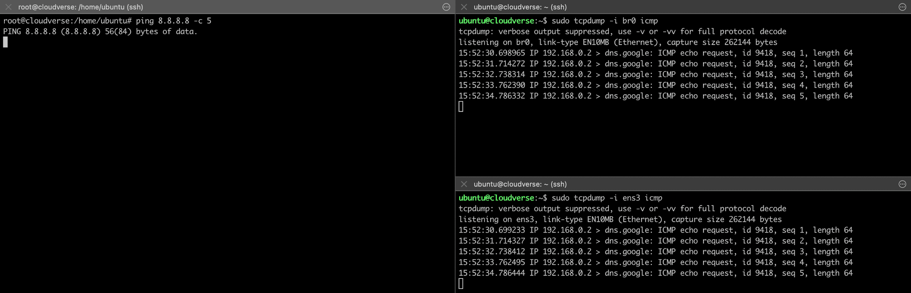

Here we can see that packets are coming to those interfaces but are
still stuck in ns0. But why?

### Root Cause

See! The source IP address, 192.168.0.2, is attempting to connect to
Google DNS 8.8.8.8 using its private IP address. So it's very basic that
the outside world can't reach that private IP because they have no idea
about that particular private IP address. That's why packets are able to
reach Google DNS, but we are not getting any replies from 8.8.8.8.

### Solution

We must somehow change the private IP address to a public address in
order to sort out this issue with the help of NAT (Network Translation
Address). So, a SNAT (source NAT) rule must be added to the IP table in
order to modify the POSTROUTING chain.

sudo iptables -t nat -A POSTROUTING -s 192.168.0.0/16 -j MASQUERADE

### Role of POSTROUTING

The POSTROUTING chain in iptables is part of the NAT (Network Address
Translation) table, and it is applied to packets after the routing
decision has been made but before the packets are sent out of the
system. The primary purpose of the POSTROUTING chain is to perform
Source Network Address Translation (SNAT) or MASQUERADE on outgoing
packets.

### MASQUERADE Action

The MASQUERADE target in iptables is used for Network Address
Translation (NAT) in order to hide the true source address of outgoing
packets. Here, when the packet matches the conditions specified in an
iptables rule with the MASQUERADE target, the source IP address of the
packet is dynamically replaced with the IP address of the outgoing
interface. The NAT engine on the router or gateway replaces the private
source IP address with its own public IP address before forwarding the
packet to the external network. When the external network sends a reply
back to the public IP address, the NAT engine tracks the translation and
forwards the reply back to the original private IP address within the
internal network.

### Firewall rules

sudo iptables -t nat -L -n -v

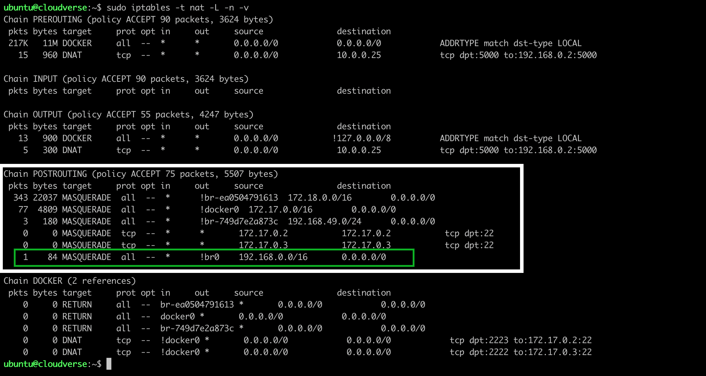

In case if still it not works then we may need to add some additional
firewall rules.

> sudo iptables --append FORWARD --in-interface br0 --jump ACCEPT

sudo iptables --append FORWARD --out-interface br0 --jump ACCEPT

These rules enabled traffic to travel across the br0 virtual
bridge.These are useful to allow all traffic to pass through the br0
interface without any restrictions. However, keep in mind that using
such rules without any filtering can expose your system to potential
security risks. But for now we re good to ping!

### Test Connectivity

ping 8.8.8.8 -c 5

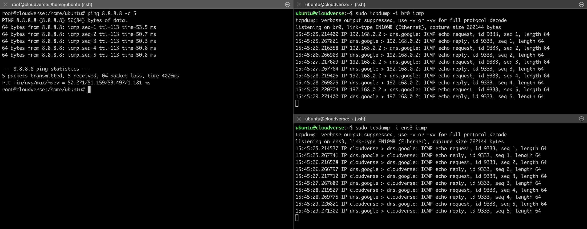

Bingo!

## Experiment 5: Connect Two Custom Network Namespaces

### Setting up Virtual Network between Namespaces

This guide outlines the steps to create two namespaces named
***blue-namespace*** and ***lemon-namespace***, and establish a virtual
Ethernet network between them using ***veth*** interfaces. The goal is
to enable communication between the namespaces and allow them to ping
each other.

## Prerequisites

-   Linux operating system

-   Root or sudo access

-   Packages

> sudo apt update
>
> sudo apt upgrade -y
>
> sudo apt install iproute2

-   sudo apt install net-tools

### Steps

## 1. Enable IP forwarding in the Linux kernel:

sudo sysctl -w net.ipv4.ip\_forward=1

This step enables IP forwarding in the Linux kernel, allowing the
namespaces to communicate with each other.

## 2. Create namespaces:

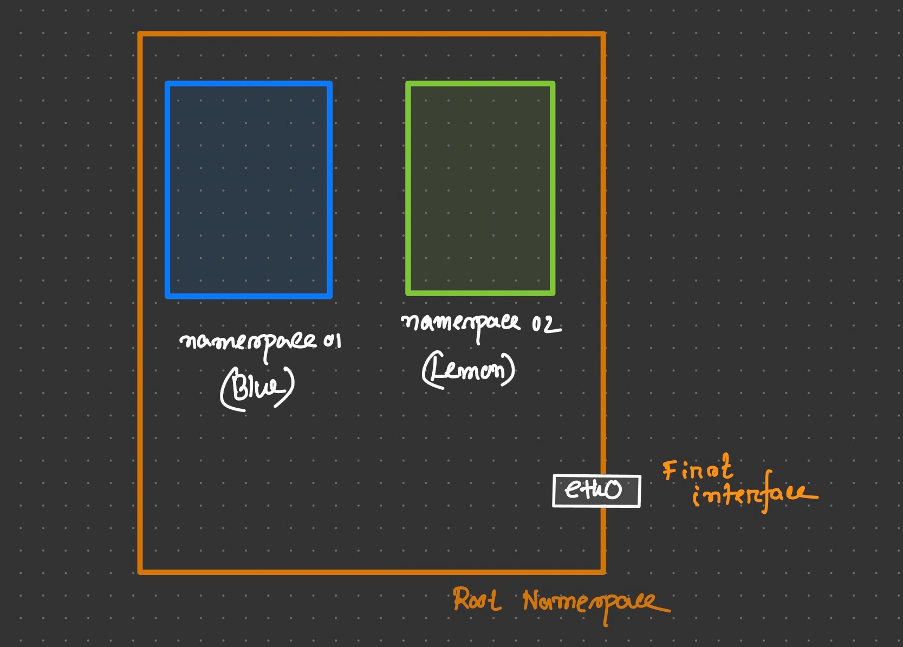

> sudo ip netns add blue-namespace

sudo ip netns add lemon-namespace

This step creates two namespaces named ***blue-namespace*** and
***lemon-namespace***.

## 3. Create the virtual Ethernet link pair:

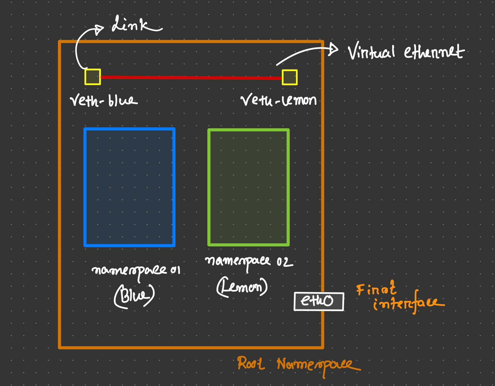

sudo ip link add veth-blue type veth peer name veth-lemon

This command creates a virtual Ethernet link pair consisting of
veth-blue and veth-lemon at ***root namespace***.

In order to verify, run sudo ip link list

**Expected Output:**

> 6: veth-lemon@veth-blue: &lt;BROADCAST,MULTICAST,M-DOWN&gt; mtu 1500
> qdisc noop state DOWN mode DEFAULT group default qlen 1000
>
> link/ether 22:21:fc:9e:d0:2b brd ff:ff:ff:ff:ff:ff
>
> 7: veth-blue@veth-lemon: &lt;BROADCAST,MULTICAST,M-DOWN&gt; mtu 1500
> qdisc noop state DOWN mode DEFAULT group default qlen 1000

link/ether 2e:34:8e:0c:1c:6e brd ff:ff:ff:ff:ff:ff

## 4. Set the cable as NIC

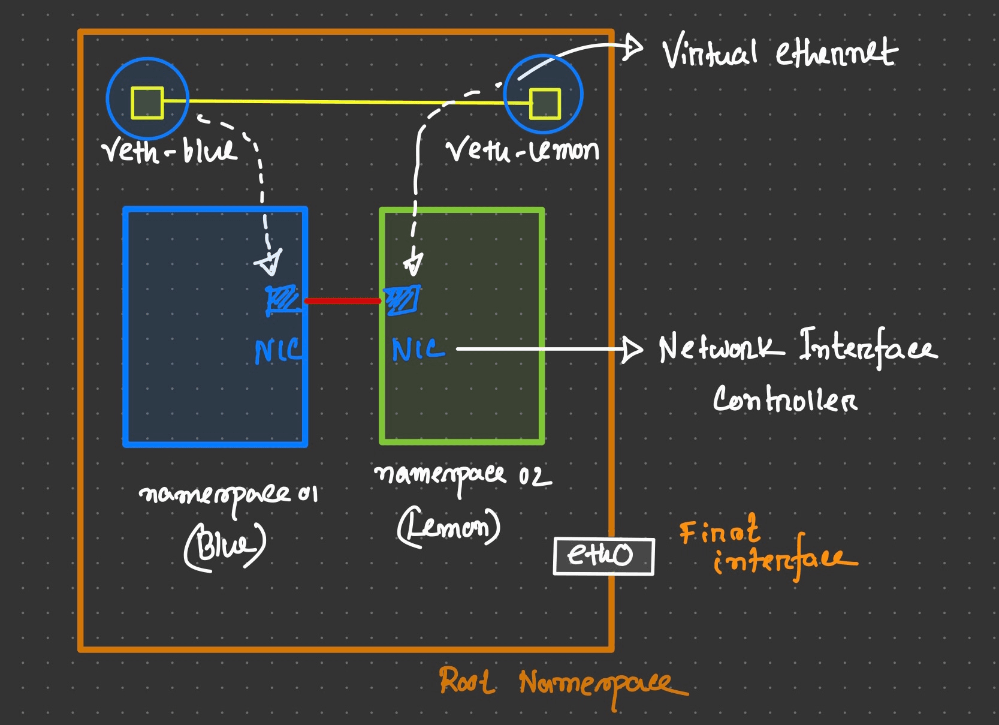

> sudo ip link set veth-blue netns blue-namespace

sudo ip link set veth-lemon netns lemon-namespace

This command acts as ***NIC*** link pair consisting of veth-blue and
veth-lemon.

To verify run sudo ip netns exec blue-namespace ip link and sudo ip
netns exec lemon-namespace ip link

**Expected Output**

> 1: lo: &lt;LOOPBACK&gt; mtu 65536 qdisc noop state DOWN mode DEFAULT
> group default qlen 1000
>
> link/loopback 00:00:00:00:00:00 brd 00:00:00:00:00:00
>
> 7: veth-blue@if6: &lt;BROADCAST,MULTICAST&gt; mtu 1500 qdisc noop
> state DOWN mode DEFAULT group default qlen 1000

link/ether 2e:34:8e:0c:1c:6e brd ff:ff:ff:ff:ff:ff link-netns
lemon-namespace

and

> 1: lo: &lt;LOOPBACK&gt; mtu 65536 qdisc noop state DOWN mode DEFAULT
> group default qlen 1000
>
> link/loopback 00:00:00:00:00:00 brd 00:00:00:00:00:00
>
> 6: veth-lemon@if7: &lt;BROADCAST,MULTICAST&gt; mtu 1500 qdisc noop
> state DOWN mode DEFAULT group default qlen 1000

link/ether 22:21:fc:9e:d0:2b brd ff:ff:ff:ff:ff:ff link-netns
blue-namespace

But as we see, interface has been created but it's **DOWN** and has no
ip. Now assign a ip address and turn it **UP**.

## 5. Assign IP Addresses to the Interfaces

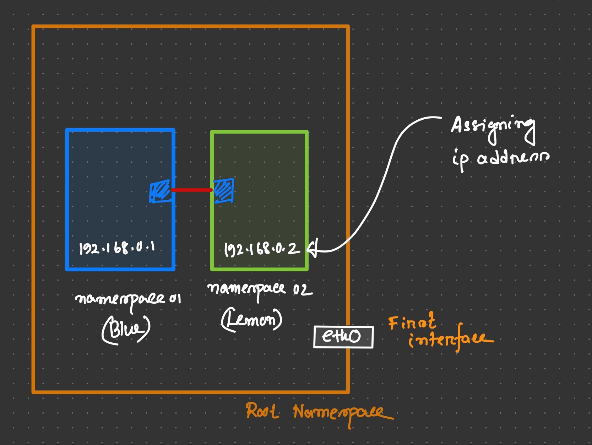

> sudo ip netns exec blue-namespace ip addr add 192.168.0.1/24 dev
> veth-blue

sudo ip netns exec lemon-namespace ip addr add 192.168.0.2/24 dev
veth-lemon

In this step, IP addresses are assigned to the veth-blue interface in
the blue-namespace and to the veth-lemon interface in the
lemon-namespace.

To verify run sudo ip netns exec blue-namespace ip addr and sudo ip
netns exec lemon-namespace ip addr

**Expected Output:**

> 7: veth-blue@if6: &lt;BROADCAST,MULTICAST&gt; mtu 1500 qdisc noop
> state DOWN group default qlen 1000
>
> link/ether 2e:34:8e:0c:1c:6e brd ff:ff:ff:ff:ff:ff link-netns
> lemon-namespace
>
> inet 192.168.0.1/24 scope global veth-blue

valid\_lft forever preferred\_lft forever

and

> 6: veth-lemon@if7: &lt;BROADCAST,MULTICAST&gt; mtu 1500 qdisc noop
> state DOWN group default qlen 1000
>
> link/ether 22:21:fc:9e:d0:2b brd ff:ff:ff:ff:ff:ff link-netns
> blue-namespace
>
> inet 192.168.0.2/24 scope global veth-lemon

valid\_lft forever preferred\_lft forever

## 6. Set the Interfaces Up

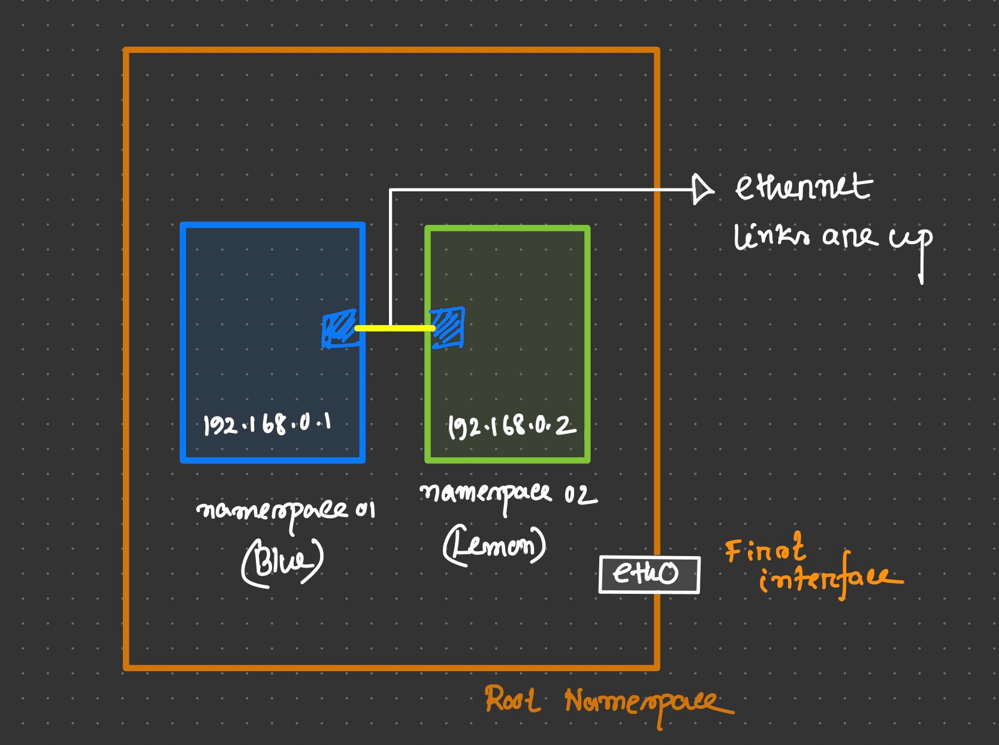

> sudo ip netns exec blue-namespace ip link set veth-blue up

sudo ip netns exec lemon-namespace ip link set veth-lemon up

These commands set the veth-blue and veth-lemon interfaces ***up***,
enabling them to transmit and receive data.

Now run again sudo ip netns exec blue-namespace ip link and sudo ip
netns exec lemon-namespace ip link to verify

**Expected Output:**

> 7: veth-blue@if6: &lt;BROADCAST,MULTICAST,UP,LOWER\_UP&gt; mtu 1500
> qdisc noqueue state UP mode DEFAULT group default qlen 1000

link/ether 2e:34:8e:0c:1c:6e brd ff:ff:ff:ff:ff:ff link-netns
lemon-namespace

and

> 6: veth-lemon@if7: &lt;BROADCAST,MULTICAST,UP,LOWER\_UP&gt; mtu 1500
> qdisc noqueue state UP mode DEFAULT group default qlen 1000

link/ether 22:21:fc:9e:d0:2b brd ff:ff:ff:ff:ff:ff link-netns
blue-namespace

## 7. Set Default Routes

> sudo ip netns exec blue-namespace ip route add default via 192.168.0.1
> dev veth-blue

sudo ip netns exec lemon-namespace ip route add default via 192.168.0.2
dev veth-lemon

These commands set the **default routes** within each namespace,
allowing them to route network traffic.

In order to verify run sudo ip netns exec blue-namespace ip route and
sudo ip netns exec lemon-namespace ip route

**Expected Output:**

> default via 192.168.0.1 dev veth-blue

192.168.0.0/24 dev veth-blue proto kernel scope link src 192.168.0.1

and

> default via 192.168.0.2 dev veth-lemon

192.168.0.0/24 dev veth-lemon proto kernel scope link src 192.168.0.2

### In addition, the route command in the context of the ip netns exec allows you to view the routing table of a specific network namespace. The routing table contains information about how network traffic should be forwarded or delivered.

To view the routing table of the lemon-namespace, you can execute the
following command:

sudo ip netns exec lemon-namespace route

***Output***

> Kernel IP routing table
>
> Destination Gateway Genmask Flags Metric Ref Use Iface
>
> default 192.168.0.2 0.0.0.0 UG 0 0 0 veth-lemon

192.168.0.0 0.0.0.0 255.255.255.0 U 0 0 0 veth-lemon

To view the routing table of the blue-namespace, you can execute the
following command:

sudo ip netns exec blue-namespace route

**Output**

> Kernel IP routing table
>
> Destination Gateway Genmask Flags Metric Ref Use Iface
>
> default 192.168.0.1 0.0.0.0 UG 0 0 0 veth-blue

192.168.0.0 0.0.0.0 255.255.255.0 U 0 0 0 veth-blue

## 8. Test Connectivity

> sudo ip netns exec blue-namespace ping 192.168.0.2

sudo ip netns exec lemon-namespace ping 192.168.0.1

Use these commands to test the connectivity between the namespaces by
pinging each other's IP address.

**Expected Output:**

> PING 192.168.0.2 (192.168.0.2) 56(84) bytes of data.
>
> 64 bytes from 192.168.0.2: icmp\_seq=1 ttl=64 time=0.024 ms
>
> 64 bytes from 192.168.0.2: icmp\_seq=2 ttl=64 time=0.069 ms
>
> 64 bytes from 192.168.0.2: icmp\_seq=3 ttl=64 time=0.063 ms
>
> 64 bytes from 192.168.0.2: icmp\_seq=4 ttl=64 time=0.064 ms
>
> 64 bytes from 192.168.0.2: icmp\_seq=5 ttl=64 time=0.063 ms
>
> ^C
>
> --- 192.168.0.2 ping statistics ---
>
> 5 packets transmitted, 5 received, 0% packet loss, time 4099ms

rtt min/avg/max/mdev = 0.024/0.056/0.069/0.016 ms

and

> PING 192.168.0.1 (192.168.0.1) 56(84) bytes of data.
>
> 64 bytes from 192.168.0.1: icmp\_seq=1 ttl=64 time=0.033 ms
>
> 64 bytes from 192.168.0.1: icmp\_seq=2 ttl=64 time=0.072 ms
>
> 64 bytes from 192.168.0.1: icmp\_seq=3 ttl=64 time=0.071 ms
>
> 64 bytes from 192.168.0.1: icmp\_seq=4 ttl=64 time=0.074 ms
>
> 64 bytes from 192.168.0.1: icmp\_seq=5 ttl=64 time=0.070 ms
>
> ^C
>
> --- 192.168.0.1 ping statistics ---
>
> 5 packets transmitted, 5 received, 0% packet loss, time 4099ms

rtt min/avg/max/mdev = 0.033/0.064/0.074/0.015 ms

### Furthermore, the arp command in the context of the ip netns exec allows you to view the ARP cache of a specific network namespace. The ARP cache contains mappings of IP addresses to MAC addresses.

To view the ARP cache of the blue-namespace, you can execute the
following command:

sudo ip netns exec blue-namespace arp

***Output***

> Address HWtype HWaddress Flags Mask Iface
>
> 127.0.0.53 (incomplete) veth-blue

192.168.0.2 ether 22:21:fc:9e:d0:2b C veth-blue

To view the ARP cache of the lemon-namespace, you can execute the
following command:

sudo ip netns exec lemon-namespace arp

***Output***

> Address HWtype HWaddress Flags Mask Iface
>
> 192.168.0.1 ether 2e:34:8e:0c:1c:6e C veth-lemon

127.0.0.53 (incomplete) veth-lemon

## 9. Clean Up (optional)

> sudo ip netns del blue-namespace

sudo ip netns del lemon-namespace

If you want to remove the namespaces run these commands to clean up the
setup.

## Experiment 6: Bridge Networking Among Namespaces

### Setting up Linux Bridge Network among Namespaces

This guide outlines the steps to create three namespaces named
**blue-ns**, **gray-ns** and **lime-ns**. Then establish a linux bridge
network among them using ***veth*** interfaces. The goal is to enable
communication among the namespaces and allow them to ping each other.

## Prerequisites

-   Linux operating system

-   Root or sudo access

-   Packages

> sudo apt update
>
> sudo apt upgrade -y
>
> sudo apt install iproute2

-   sudo apt install net-tools

## Step 1: Create a Linux bridge:

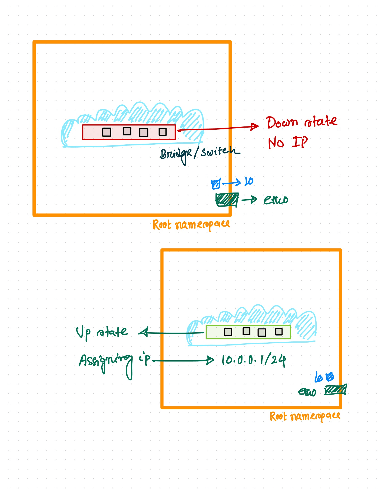

sudo ip link add dev v-net type bridge

Lets run sudo ip links show to check and the ***expected output*** might
look like

> 12: v-net: &lt;BROADCAST,MULTICAST&gt; mtu 1500 qdisc noop state DOWN
> mode DEFAULT group default qlen 1000

link/ether d2:22:49:28:a4:c8 brd ff:ff:ff:ff:ff:ff

But here v-net is now in down state. So lets turn into **up**.

sudo ip link set dev v-net up

and now ***expected output*** might look like

> 12: v-net: &lt;NO-CARRIER,BROADCAST,MULTICAST,UP&gt; mtu 1500 qdisc
> noqueue state DOWN mode DEFAULT group default qlen 1000

link/ether d2:22:49:28:a4:c8 brd ff:ff:ff:ff:ff:ff

Here, the "UP" flag indicates that the interface is enabled and
operational, while the "DOWN" state indicates that the interface is
currently inactive or not functioning as there is no any physical
connectivity of the interface right now.

## Step 2: Assign an IP address to the bridge interface 'v-net':

sudo ip address add 10.0.0.1/24 dev v-net

Run sudo ip addr show dev v-net

> 12: v-net: &lt;NO-CARRIER,BROADCAST,MULTICAST,UP&gt; mtu 1500 qdisc
> noqueue state DOWN group default qlen 1000
>
> link/ether d2:22:49:28:a4:c8 brd ff:ff:ff:ff:ff:ff
>
> inet 10.0.0.1/24 scope global v-net

valid\_lft forever preferred\_lft forever

## Step 3: Create three network namespaces:

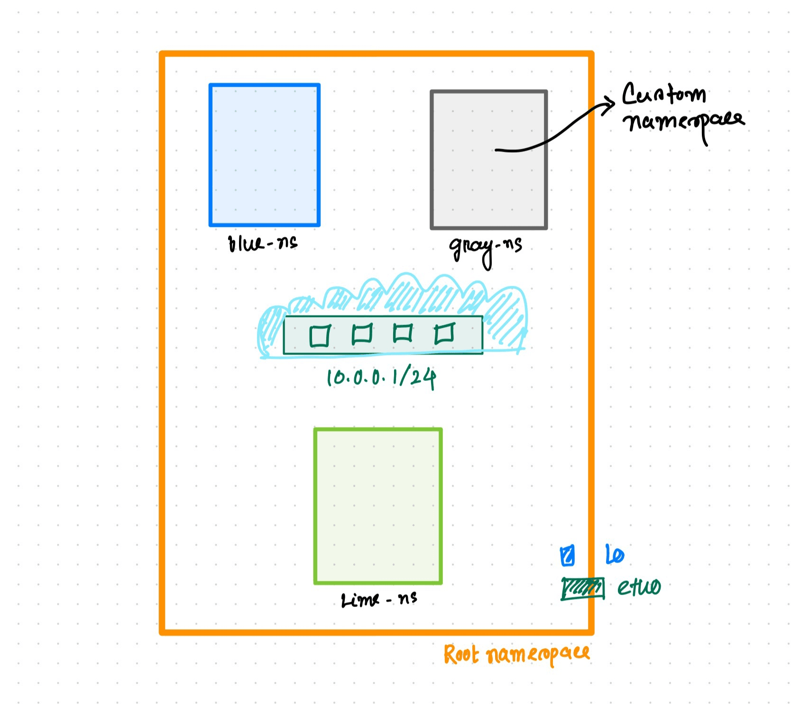

> sudo ip netns add blue-ns
>
> sudo ip netns add gray-ns

sudo ip netns add lime-ns

Run sudo ip netns list to check the list of namespaces.

## Step 4: Create virtual Ethernet pairs:

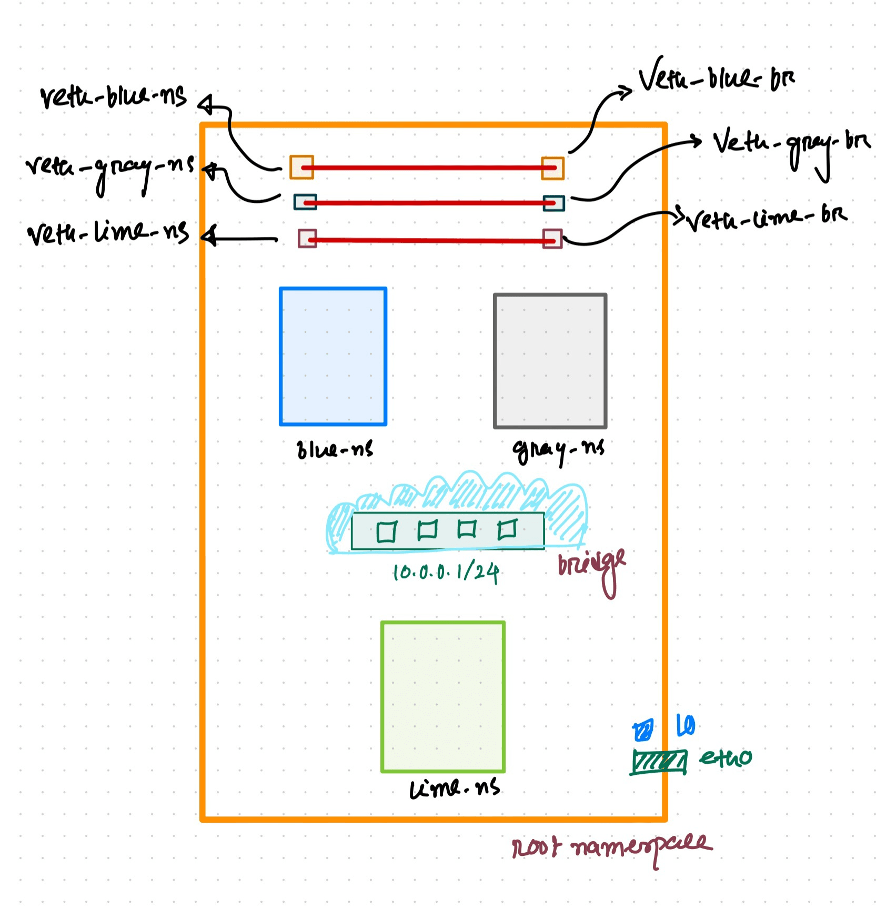

> sudo ip link add veth-blue-ns type veth peer name veth-blue-br
>
> sudo ip link add veth-gray-ns type veth peer name veth-gray-br

sudo ip link add veth-lime-ns type veth peer name veth-lime-br

Each cable now has two ends. Before connecting them to the appropriate
bridge and namespaces, run sudo ip link show command to verify if the
cables have been successfully created. ***Expected Output***

> 13: veth-blue-br@veth-blue-ns: &lt;BROADCAST,MULTICAST,M-DOWN&gt; mtu
> 1500 qdisc noop state DOWN mode DEFAULT group default qlen 1000
>
> link/ether fa:b8:a7:3c:41:0a brd ff:ff:ff:ff:ff:ff
>
> 14: veth-blue-ns@veth-blue-br: &lt;BROADCAST,MULTICAST,M-DOWN&gt; mtu
> 1500 qdisc noop state DOWN mode DEFAULT group default qlen 1000
>
> link/ether ea:ff:ec:28:f3:aa brd ff:ff:ff:ff:ff:ff
>
> 15: veth-gray-br@veth-gray-ns: &lt;BROADCAST,MULTICAST,M-DOWN&gt; mtu
> 1500 qdisc noop state DOWN mode DEFAULT group default qlen 1000
>
> link/ether be:2a:cb:68:4d:18 brd ff:ff:ff:ff:ff:ff
>
> 16: veth-gray-ns@veth-gray-br: &lt;BROADCAST,MULTICAST,M-DOWN&gt; mtu
> 1500 qdisc noop state DOWN mode DEFAULT group default qlen 1000
>
> link/ether 1a:08:51:d7:ab:95 brd ff:ff:ff:ff:ff:ff
>
> 17: veth-lime-br@veth-lime-ns: &lt;BROADCAST,MULTICAST,M-DOWN&gt; mtu
> 1500 qdisc noop state DOWN mode DEFAULT group default qlen 1000
>
> link/ether 02:9a:fd:3e:85:8a brd ff:ff:ff:ff:ff:ff
>
> 18: veth-lime-ns@veth-lime-br: &lt;BROADCAST,MULTICAST,M-DOWN&gt; mtu
> 1500 qdisc noop state DOWN mode DEFAULT group default qlen 1000

link/ether fe:c0:37:07:25:e4 brd ff:ff:ff:ff:ff:ff

## Step 5: Move each end of veth cable to a different namespace:

> sudo ip link set dev veth-blue-ns netns blue-ns
>
> sudo ip link set dev veth-gray-ns netns gray-ns

sudo ip link set dev veth-lime-ns netns lime-ns

Run sudo ip netns exec &lt;namespace-name&gt; ip link show to verify

## Step 6: Add the other end of the virtual interfaces to the bridge:

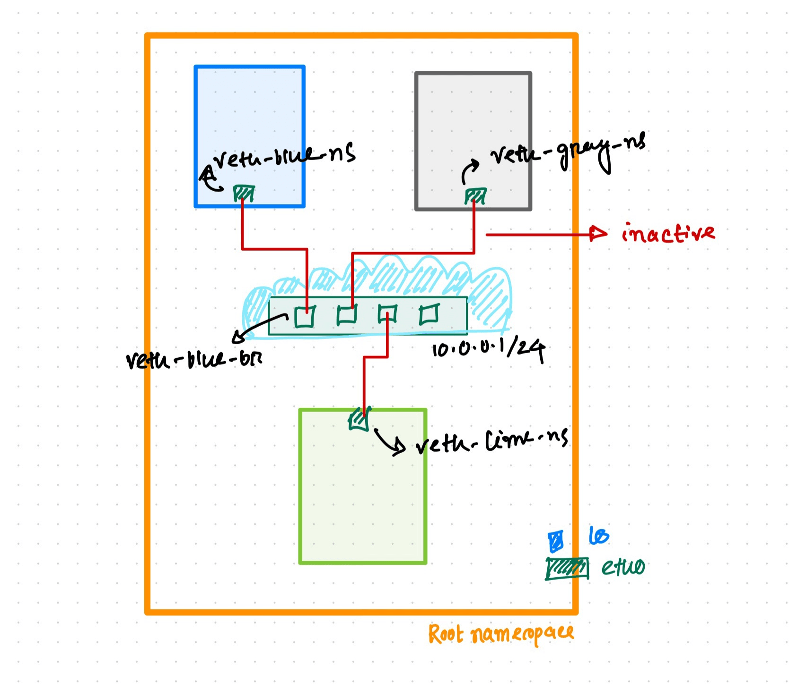

> sudo ip link set dev veth-blue-br master v-net
>
> sudo ip link set dev veth-gray-br master v-net

sudo ip link set dev veth-lime-br master v-net

Again run sudo ip link show command to verify.

## Step 7: Set the bridge interfaces up:

> sudo ip link set dev veth-blue-br up
>
> sudo ip link set dev veth-gray-br up

sudo ip link set dev veth-lime-br up

Run sudo ip link show and ***expected output*** might look like

> 13: veth-blue-br@if14: &lt;NO-CARRIER,BROADCAST,MULTICAST,UP&gt; mtu
> 1500 qdisc noqueue master v-net state LOWERLAYERDOWN mode DEFAULT
> group default qlen 1000
>
> link/ether fa:b8:a7:3c:41:0a brd ff:ff:ff:ff:ff:ff link-netns blue-ns
>
> 15: veth-gray-br@if16: &lt;NO-CARRIER,BROADCAST,MULTICAST,UP&gt; mtu
> 1500 qdisc noqueue master v-net state LOWERLAYERDOWN mode DEFAULT
> group default qlen 1000
>
> link/ether be:2a:cb:68:4d:18 brd ff:ff:ff:ff:ff:ff link-netns gray-ns
>
> 17: veth-lime-br@if18: &lt;NO-CARRIER,BROADCAST,MULTICAST,UP&gt; mtu
> 1500 qdisc noqueue master v-net state LOWERLAYERDOWN mode DEFAULT
> group default qlen 1000

link/ether 02:9a:fd:3e:85:8a brd ff:ff:ff:ff:ff:ff link-netns lime-ns

The "LOWERLAYERDOWN" state typically applies to virtual interfaces that
are dependent on another interface or component. If one end is not
currently in the 'up' state, it suggests that there may be an issue with
the namespaces at that end (in our case).

## Step 8: Set the namespace interfaces up:

> sudo ip netns exec blue-ns ip link set dev veth-blue-ns up
>
> sudo ip netns exec gray-ns ip link set dev veth-gray-ns up

sudo ip netns exec lime-ns ip link set dev veth-lime-ns up

Now, run sudo ip link show command again and it should show all
interfaces are currently in UP state.

## Step 9: Assign IP addresses to the virtual interfaces within each namespace and set the default routes:

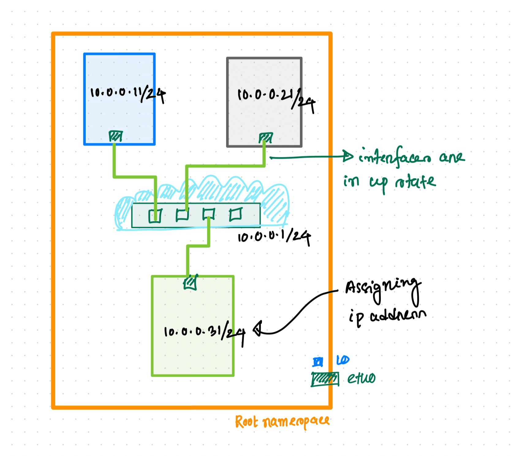

-   In the blue-ns namespace:

> sudo ip netns exec blue-ns ip address add 10.0.0.11/24 dev
> veth-blue-ns

-   sudo ip netns exec blue-ns ip route add default via 10.0.0.1

-   In the gray-ns namespace:

> sudo ip netns exec gray-ns ip address add 10.0.0.21/24 dev
> veth-gray-ns

-   sudo ip netns exec gray-ns ip route add default via 10.0.0.1

-   In the lime-ns namespace:

> sudo ip netns exec lime-ns ip address add 10.0.0.31/24 dev
> veth-lime-ns

-   sudo ip netns exec lime-ns ip route add default via 10.0.0.1

## Step 10: Firewall rules:

> sudo iptables --append FORWARD --in-interface v-net --jump ACCEPT

sudo iptables --append FORWARD --out-interface v-net --jump ACCEPT

These rules enabled traffic to travel across the v-net virtual
bridge.These are useful to allow all traffic to pass through the v-net
interface without any restrictions.However, keep in mind that using such
rules without any filtering can expose your system to potential security
risks. But for now we re good to ping!

### Test Connectivity

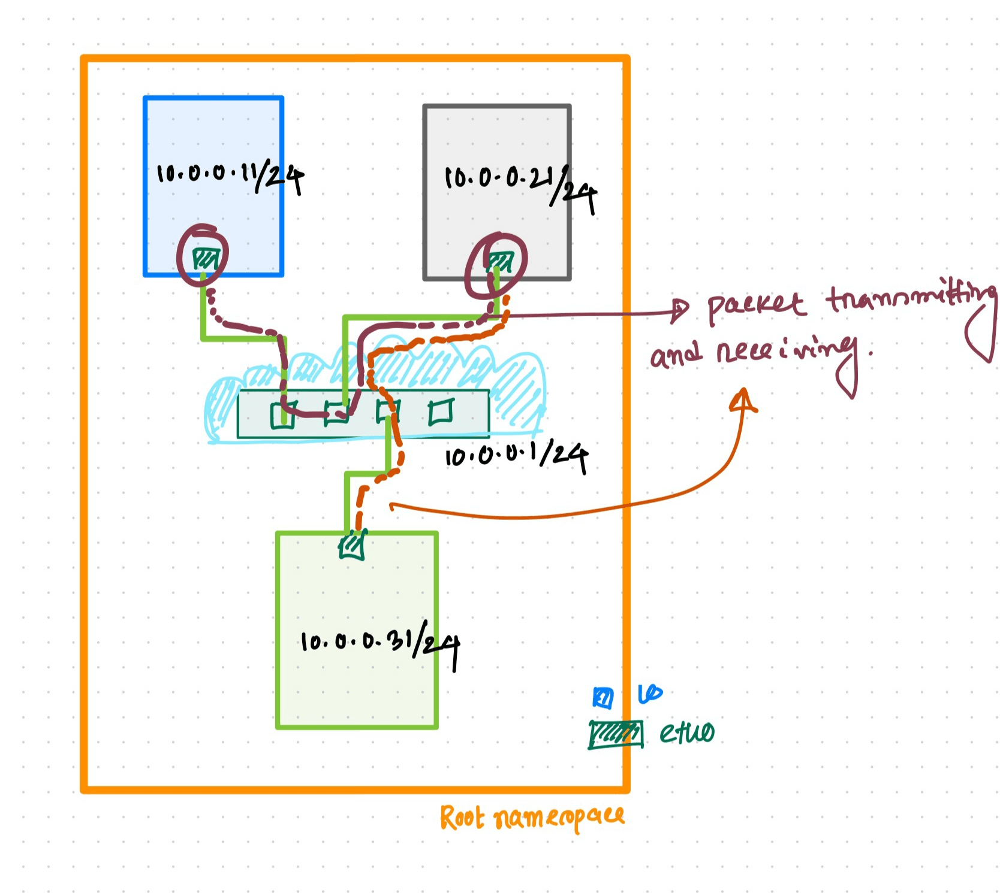

sudo ip netns exec lime-ns ping -c 2 10.0.0.11

***Expected Output***

> PING 10.0.0.11 (10.0.0.11) 56(84) bytes of data.
>
> 64 bytes from 10.0.0.11: icmp\_seq=1 ttl=64 time=0.064 ms
>
> 64 bytes from 10.0.0.11: icmp\_seq=2 ttl=64 time=0.169 ms
>
> --- 10.0.0.11 ping statistics ---
>
> 2 packets transmitted, 2 received, 0% packet loss, time 1006ms

rtt min/avg/max/mdev = 0.064/0.116/0.169/0.052 ms

Another one:

sudo ip netns exec gray-ns ping -c 2 10.0.0.11

***Expected Output***

> PING 10.0.0.11 (10.0.0.11) 56(84) bytes of data.
>
> 64 bytes from 10.0.0.11: icmp\_seq=1 ttl=64 time=0.051 ms
>
> 64 bytes from 10.0.0.11: icmp\_seq=2 ttl=64 time=0.112 ms
>
> --- 10.0.0.11 ping statistics ---
>
> 2 packets transmitted, 2 received, 0% packet loss, time 1024ms

rtt min/avg/max/mdev = 0.051/0.081/0.112/0.030 ms

Another one:

sudo ip netns exec blue-ns ping -c 2 10.0.0.21

***Expected Output***

> PING 10.0.0.21 (10.0.0.21) 56(84) bytes of data.
>
> 64 bytes from 10.0.0.21: icmp\_seq=1 ttl=64 time=0.056 ms
>
> 64 bytes from 10.0.0.21: icmp\_seq=2 ttl=64 time=0.109 ms
>
> --- 10.0.0.21 ping statistics ---
>
> 2 packets transmitted, 2 received, 0% packet loss, time 1018ms

rtt min/avg/max/mdev = 0.056/0.082/0.109/0.026 ms

Another one:

sudo ip netns exec blue-ns ping -c 2 10.0.0.31

***Expected Output***

> PING 10.0.0.31 (10.0.0.31) 56(84) bytes of data.
>
> 64 bytes from 10.0.0.31: icmp\_seq=1 ttl=64 time=0.073 ms
>
> 64 bytes from 10.0.0.31: icmp\_seq=2 ttl=64 time=0.127 ms
>
> --- 10.0.0.31 ping statistics ---
>
> 2 packets transmitted, 2 received, 0% packet loss, time 1031ms

rtt min/avg/max/mdev = 0.073/0.100/0.127/0.027 ms

## In addition, the route command in the context of the ip netns exec allows you to view the routing table of a specific network namespace. The routing table contains information about how network traffic should be forwarded or delivered.

To view the routing table of the blue-ns namespace, execute the
following command:

sudo ip netns exec blue-ns route

*Output:*

> Kernel IP routing table
>
> Destination Gateway Genmask Flags Metric Ref Use Iface
>
> default 10.0.0.1 0.0.0.0 UG 0 0 0 veth-blue-ns

10.0.0.0 0.0.0.0 255.255.255.0 U 0 0 0 veth-blue-ns

To view the routing table of the gray-ns namespace, execute the
following command:

sudo ip netns exec gray-ns route

*Output:*

> Kernel IP routing table
>
> Destination Gateway Genmask Flags Metric Ref Use Iface
>
> default 10.0.0.1 0.0.0.0 UG 0 0 0 veth-gray-ns

10.0.0.0 0.0.0.0 255.255.255.0 U 0 0 0 veth-gray-ns

To view the routing table of the lime-ns namespace, execute the
following command:

sudo ip netns exec lime-ns route

*Output:*

> Kernel IP routing table
>
> Destination Gateway Genmask Flags Metric Ref Use Iface
>
> default 10.0.0.1 0.0.0.0 UG 0 0 0 veth-lime-ns

10.0.0.0 0.0.0.0 255.255.255.0 U 0 0 0 veth-lime-ns

## Furthermore, the arp command in the context of the ip netns exec allows you to view the ARP cache of a specific network namespace. The ARP cache contains mappings of IP addresses to MAC addresses.

To view the ARP cache of the blue-ns namespace, execute the following
command:

sudo ip netns exec blue-ns arp

*Output*

> Address HWtype HWaddress Flags Mask Iface
>
> 10.0.0.1 ether d2:22:49:28:a4:c8 C veth-blue-ns
>
> 10.0.0.31 ether fe:c0:37:07:25:e4 C veth-blue-ns

10.0.0.21 ether 1a:08:51:d7:ab:95 C veth-blue-ns

To view the ARP cache of the gray-ns namespace, execute the following
command:

sudo ip netns exec gray-ns arp

*Output*

> Address HWtype HWaddress Flags Mask Iface
>
> 10.0.0.1 ether d2:22:49:28:a4:c8 C veth-gray-ns

10.0.0.11 ether ea:ff:ec:28:f3:aa C veth-gray-ns

To view the ARP cache of the lime-ns namespace, execute the following
command:

sudo ip netns exec lime-ns arp

*Output*

> Address HWtype HWaddress Flags Mask Iface
>
> 10.0.0.1 ether d2:22:49:28:a4:c8 C veth-lime-ns

10.0.0.11 ether ea:ff:ec:28:f3:aa C veth-lime-ns

## Clean Up (optional)

> sudo ip netns del &lt;namespace&gt;

sudo ip link delete &lt;bridge network name&gt; type bridge

If you want to remove the namespaces and bridge network device run these
commands to clean up the setup.
